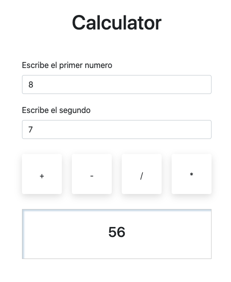

# Calculator excercise

In this javascript exercise I have created a basic calculator with 4 different operations:
Add, subtract, multiply, divide.

The user has to enter the first number in the first input, then the second number in the second input and finally choose with a button the operator

